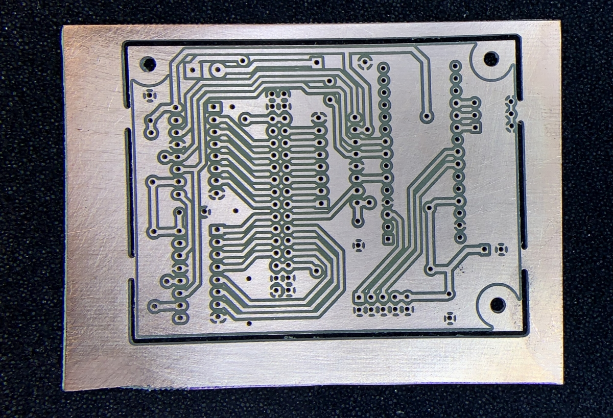
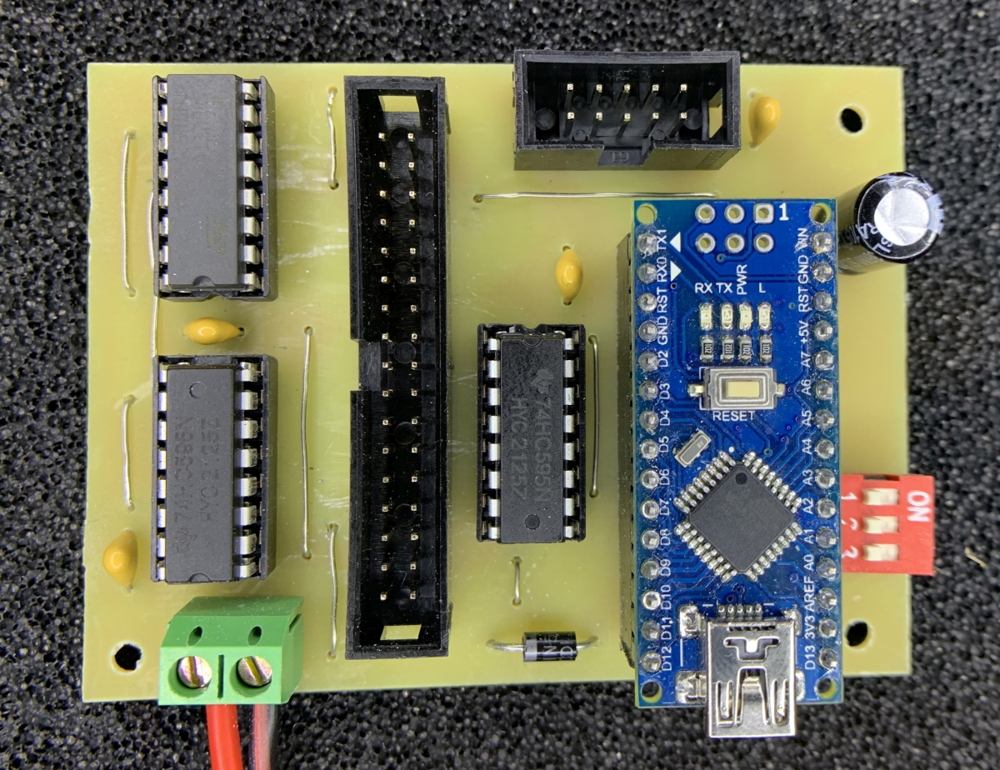

### FlipDot34Nano - One Side PTH

Driver board with Arduino Nano and three 74HC595 shift registers opitmized for single-sided PCB that can be milled with 3018 CNC. 3 digital pins are used for controlling shift registers, analog pins A4 and A5 can be used to receive commands over I2C. Pins A0-A2 connected to DIP switches choosing I2C address.

