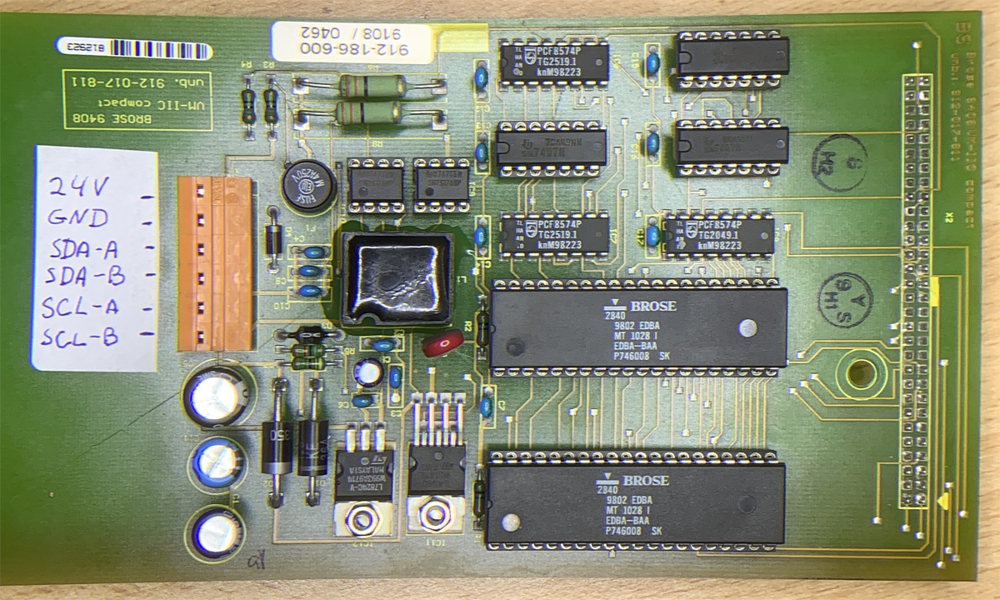
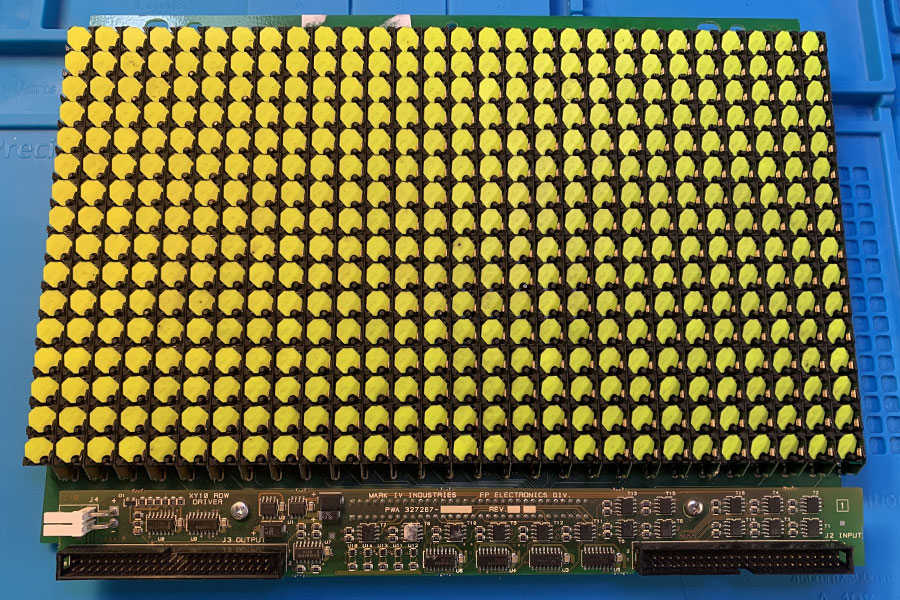
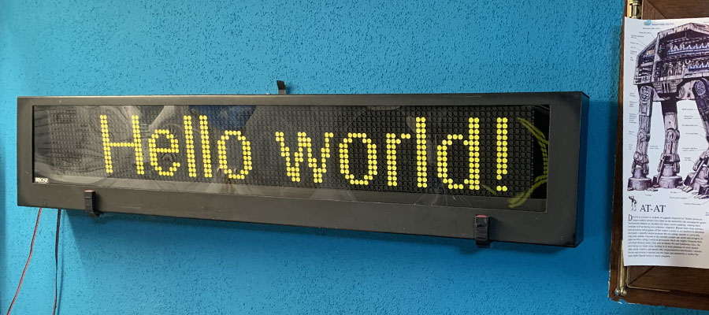
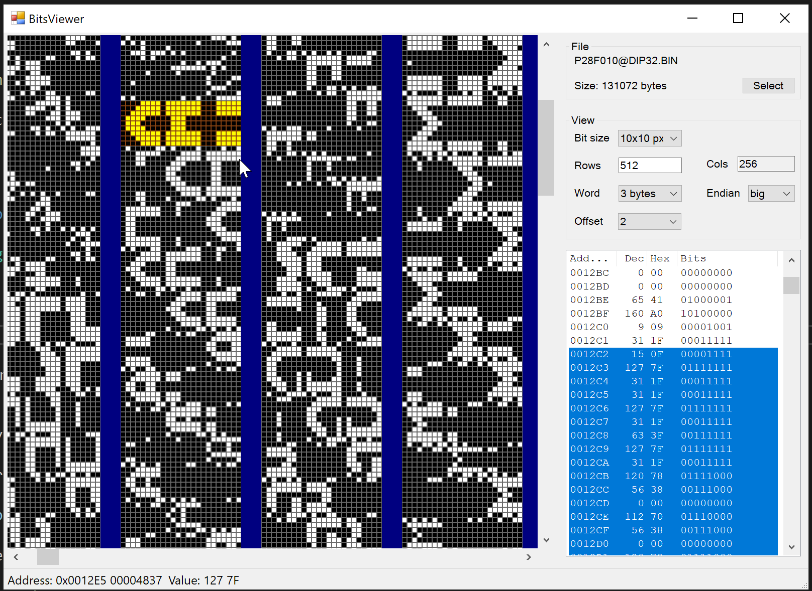

# Flip-Dot Display Projects

## Brose_63x19

DIY display with three 21x19 Brose panels. Every panel is controlled by an own Arduino Nano and there is one ESP8266 microcontroller that processes "business logic" and orchestrates the panels. The ESP has WiFi interface and can fetch actual weather data from the Internet.

## Brose_VM_IIC

Documentation and code to Brose VM_IIC board that is used in bus route destination displays and can control up to 8 flip-dot matrices each having up to 28x20 pixels. Arduino library to send commands to VM_IIC over RS-422 interface.

## Lawo 28x16

My attempt to understand how the Lawo matrix works. I am also going to make a custom driver to control it.

## WebBoard

Add REST interface to an old Brose display. The ESP32 microcontroller hosts web-server code written in C++ that sends signals to the display over RS-422 interface.

## Bit Viewer

When trying to understand how information is stored in firmware binaries it might be useful to show them graphically experimenting with different word length, big/little-endianness etc. This small program helps to find graphical patterns in binary data.

