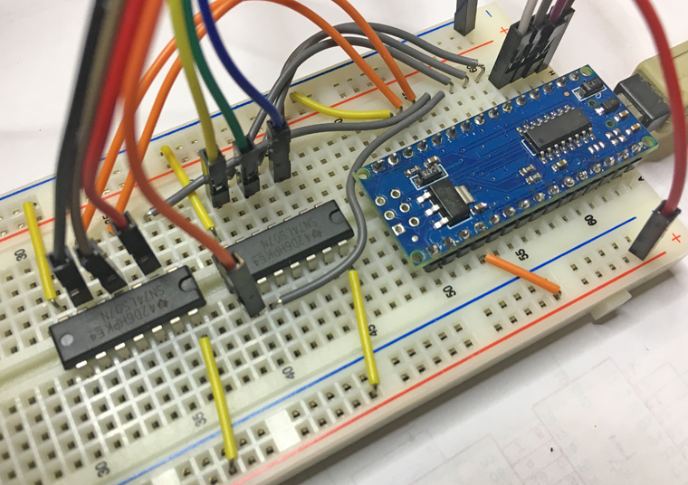

# Controlling Brose display

Use SN74LS07N buffer to control 24V Brose inputs with 5V TTL signals.

## Pinout

| Nano PIN | IC Pin | IC     | Signal |
|----------|--------|--------|--------|
| D2       | 5      | 07-2   | DATA   |
| D3       | 3      | 07-2   | A0     |
| D4       | 1      | 07-2   | A1     |
| D5       | 9      | 07-1   | A2     |
| D6       | 5      | 07-1   | B0     |
| D7       | 3      | 07-1   | B1     |
| D8       | 1      | 07-1   | ENABLE |
| D9       |        | 595    | RCLK   |
| D10      |        | 595    | SER    |
| D11      |        | 595    | SRCLK  |
| D12      |        | MOSFET | POWER  |
